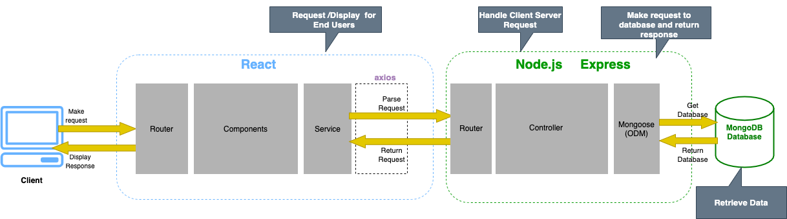

#### Documentation Part-A

#### R1. Description of your website, including:

- Purpose

- Functionality / features

- Target audience

- Tech stack

##### R2. Dataflow Diagram

##### R3. Application Architecture Diagram

##### R4. User Stories:

Initial user stories:

##### R5. Wireframes for multiple standard screen sizes, created using industry standard software

##### R6. Screenshots of your Trello board demonstrating use throughout the initial stages of the project

