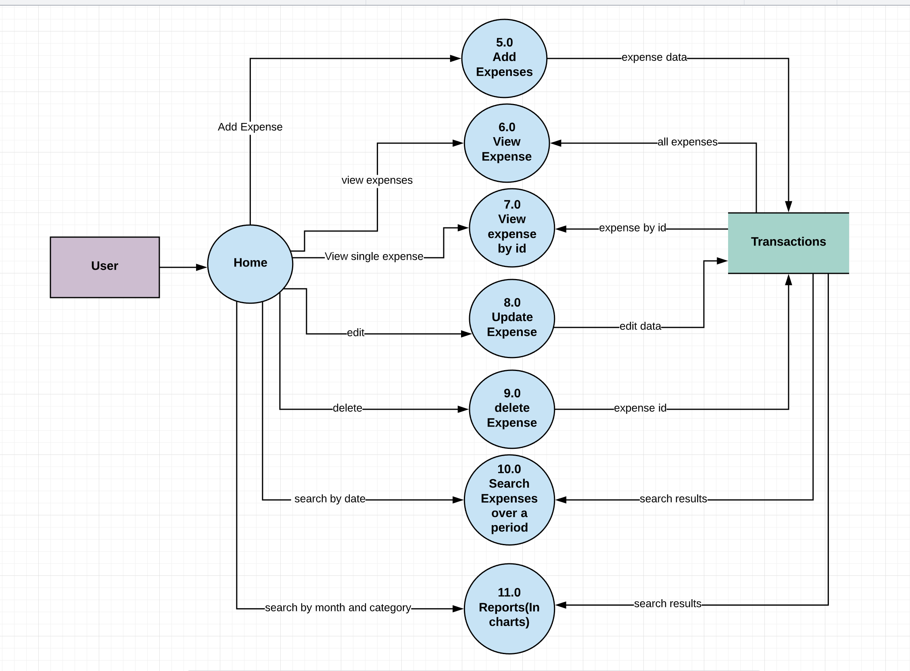
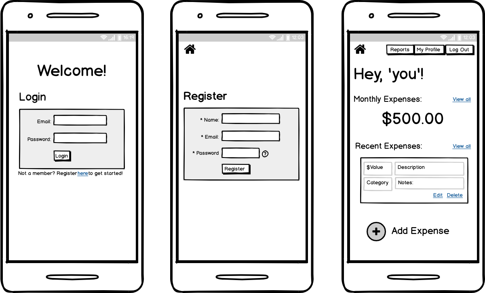

#### Documentation Part-A

#### R1. Description of your website, including:

##### Purpose
To provide a tool for the recording of personal expense data. Gives users to collate expenses by category and provide visual representation of spending habits.

##### Functionality / Features
User registration, sign-in and authentication. Creation of expense instances, including
Description, Category, Date and Value (AUD). Ability to edit existing expense instances, or delete entries. 
Filtering of existing expenses by date. Visual representation of expense trends (charting).

##### Target Audience
Users with the ability to interact with a simple interface, either desktop or mobile based. Those who want an online resource for recording and displaying spending history. 

##### Tech Stack
1. MERN Stack:
* Front End (Client):
   * React
   * HTML
   * CSS
* Back End (Server):
   * Express 
   * Node
* Database:
   * Mongo DB

2. JavaScript
###### Other Tools Used:
* Lucidchart - To Draw Data Flow Diagram.
* Draw - To draw Architectural Application Diagram.
* Balsamiq.cloud - For drawing Wireframes.
* Cardboardit - For Creating User Stories.
* Trello - For Project Management.
---
#### R2. Dataflow Diagram

DFD for users: 

DFD for transactions:

**External Entities:**
* User

**Processes:**
* 1.0: Regiser a new user and store the user details in database
* 2.0: Login user with credential.User will be authenticated and get appropriate response.
* 3.0: Update user information according to the request from user. It will also update the database.
* 4.0: Delete user and update the database by removing corresponding user details.
* 5.0: Add expenses, create new expense details for the authorised user. And stores details to the transactions database.
* 6.0: View all expense details.
* 7.0: View a single expense.
* 8.0: Update expense details based on the request from user.Also update the databse.
* 9.0: Delete expense based on the request from user. also update the database.
* 10.0: Search expense details based on the request from user.
* 11.0: Shows reports of expense based on the request from user.

**Data Storages:**

* users: It stores all details of a user.
* transactions: it stores all the transaction details of a user
---
#### R3. Application Architecture Diagram

---
#### R4. User Stories:

Initial user stories:

Final user stories:

Link to the user-story: https://app.cardboardit.com/maps/guests/d2f893bfc5b428b4efd0ad359293b037ec8cb0df16c620770199e49a03f2bd4b

---
#### R5. Wireframes for multiple standard screen sizes, created using industry standard software
Mobile  

Desktop 

----

#### R6. Screenshots of your Trello board demonstrating use throughout the initial stages of the project
04/07/2020

08/07/2020

09/07/2020

10/07/2020

